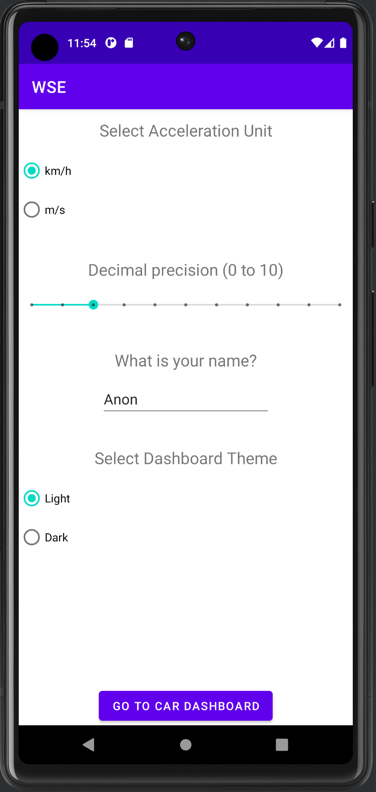
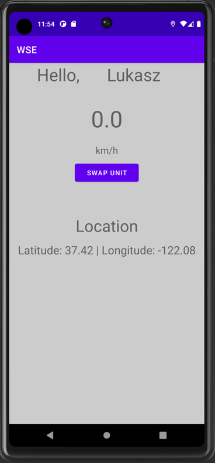

# WSE Android Car Dashboard

## Author
Łukasz Tarasiewicz, WSE, informatyka stosowana, 3 rok

Numer albumu: K12618

## Technologies
1. Android API 30
2. Material Design UI Components
5. Language: Java 17

## Views

### Landing view

Features:
- Configure the car dashboard with options such as:
    - acceleration unit for accelerometer's computations (km/h or m/s)
    - decimal precision used for displaying geolocation data (longitude and latitude)
    - driver name displayed on the dashboard
    - there (dark or light) used to style the dashboard

### Car dashboard

Features:
- Welcome message with the driver's name
- Accelerometer data displayed in the form of a speedometer and selected display unit
- A button for swapping the accelerometer's display unit
- Geolocation data displayed - longitude and latitude
